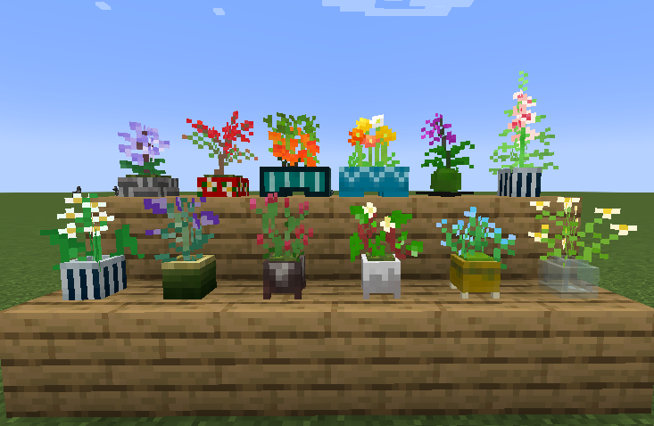

# Chika’s Plants Mod (CPM)

## 概要 / Overview

**「花も草も自由に植えられる、和の趣を添えた鉢植えMod。」**  

- 追加の鉢には、花や草など様々な植物を自由に植えられます。  
- 自作Mod以外のModで追加された植物も植えることが可能です。  
- 日本で親しまれている植物を含む、50種類以上の植物を収録。

**Plant flowers, grasses, and other plants in pots. Adds a subtle touch of Japanese style for decoration.**

- You can freely plant flowers, grasses, and other plants in the provided pots.  
- You can also plant additional plants added by other mods.  
- Includes over 50 different plant types, featuring plants familiar in Japan.

---

## 対応バージョン / Compatible Versions

- Minecraft: 1.19.2
- Forge: 43.4.20

## 導入方法 / Installation

1\. Minecraft Forge 1.19.2 をインストールしてください。  
2\. 本Modの `.jar` ファイルを Minecraft の `mods` フォルダに配置してください。  
3\. Minecraft を起動し、Mod が読み込まれていることを確認してください。

1\. Install Minecraft Forge 1.19.2.  
2\. Place the `.jar` file of this mod into the `mods` folder of your Minecraft installation.  
3\. Launch Minecraft and confirm that the mod is loaded.

---

## ライセンス / License

**Copyright (c) 2025 Chika**  
**All Rights Reserved.**

- このModは個人利用のみに限られます。  
- 個人利用の範囲で改造することは可能ですが、改造版を無断で配布することは禁止されています。  
- YouTubeやTwitchなどでこのModを使用したゲームプレイ動画や配信を公開することができます。  
- 無断での再配布および商用利用は禁止されています。また、ModPackや他の配布パッケージに無許可で含めることも禁止されています。  
- このModの使用によって生じたいかなる損害についても、作者は責任を負いません。  

詳細については LICENSE ファイルをご参照ください。

- This mod is for personal use only.  
- You may modify this mod for personal use, but redistribution of modified versions is prohibited.  
- You may publish gameplay videos or livestream using this mod on platforms like YouTube or Twitch.  
- Redistribution or commercial use is prohibited without permission. Including this mod in ModPacks or other distribution packages without explicit permission is also prohibited.  
- The author is not responsible for any damage caused by using this mod.  

For details, please refer to LICENSE file.

---

## その他 / Others

バグ報告や要望、質問などは GitHub Issues までお願いします：
For bug reports, feature requests, or questions, please use GitHub Issues:
https://github.com/chika-rrria/Chikas_Plants_Mod/issues
