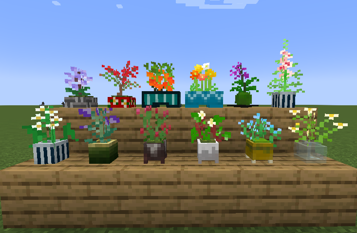

# Chika’s Plants Mod (CPM)

## 概要 / Overview

**「花も草も自由に植えられる、和の趣を添えた鉢植えMod。」**  

- 追加の鉢には、花や草など様々な植物を自由に植えられます。  
- 自作Mod以外のModで追加された植物も植えることが可能です。  
- 日本で親しまれている植物を含む、70種類以上の植物を収録。

**Plant flowers, grasses, and other plants in pots. Adds a subtle touch of Japanese style for decoration.**

- You can freely plant flowers, grasses, and other plants in the provided pots.  
- You can also plant additional plants added by other mods.  
- Includes over 70 different plant types, featuring plants familiar in Japan.

---

## 対応バージョン / Compatible Versions

- Minecraft: 1.19.2
- Forge: 43.4.20

## 導入方法 / Installation

1\. Minecraft Forge 1.19.2 をインストールしてください。  
2\. 本Modの `.jar` ファイルを Minecraft の `mods` フォルダに配置してください。  
3\. Minecraft を起動し、Mod が読み込まれていることを確認してください。

1\. Install Minecraft Forge 1.19.2.  
2\. Place the `.jar` file of this mod into the `mods` folder of your Minecraft installation.  
3\. Launch Minecraft and confirm that the mod is loaded.

---

## License

Copyright (c) 2025 Chika  
All Rights Reserved.

- Personal use and personal modifications are allowed.
- Redistribution of modified versions is prohibited.
- Modpack use through CurseForge and Modrinth is allowed.
- Reuploading this mod or redistributing the mod files outside official platforms is prohibited.
- Commercial use without permission is prohibited.

Please see the LICENSE file for full details.

## ライセンス

Copyright (c) 2025 Chika  
All Rights Reserved.

- 個人利用および個人利用目的の改造は可能です。
- 改造版の再配布は禁止されています。
- CurseForgeおよびModrinthを通したModPack利用は可能です。
- 公式プラットフォーム以外での再配布は禁止されています。
- 無断での商用利用は禁止されています。

詳細は LICENSE ファイルをご確認ください。

---

## その他 / Others
バグ報告や要望、質問などは GitHub Issues までお願いします：
For bug reports, feature requests, or questions, please use GitHub Issues:
https://github.com/chika-rrria/Chikas_Plants_Mod/issues

If you're using this mod in a modpack, feel free to let me know!
